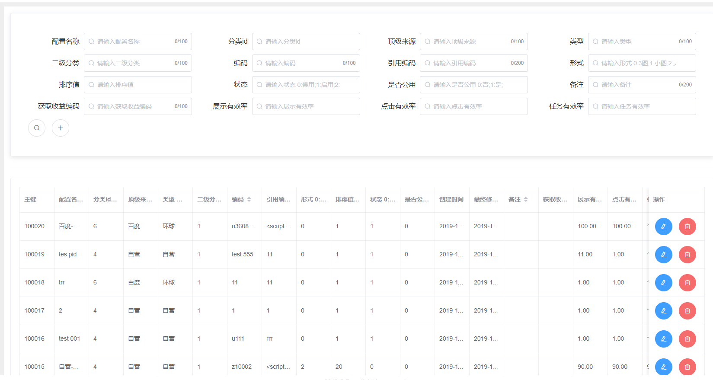
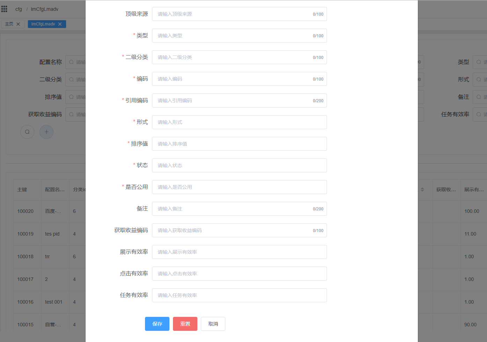

# Django and Vue base code generator
One key generate Django models\filter\serializer\views code and Vue item\list code.One key generate CRUD code.
一键生成Django models\filter\serializer\views和Vue item\list代码，实现增删改查所有功能。
## notice
This project is based on MySQLdb and jinja2.
```
pip install MySQLdb
pip install jinja2
```
## Django models\filter\serializer\views generate
### models
will add all table columns to models.
将会生成数据库表中对应的所有字段的models.field，默认按主键倒序排列，列描述为数据库中字段备注，默认可配置根据不同模块将多个models生成到同一文件
```
class Info(models.Model):
    pid = models.AutoField(primary_key=True, null=False, verbose_name='主键')
    lmadvname = models.CharField(max_length=100, null=False, verbose_name='配置名称')
    lmadvsystemid = models.IntegerField(null=False, verbose_name='分类id')
    lmadvtoptype = models.CharField(max_length=100, null=True, verbose_name='顶级来源')
    lmadvtype = models.CharField(max_length=100, null=False, verbose_name='广告类型')
    lmadvitem = models.CharField(max_length=100, null=False, verbose_name='二级分类')
    lmadvcode = models.CharField(max_length=100, null=False, verbose_name='广告编码')
    lmadvimport = models.CharField(max_length=200, null=False, verbose_name='引用编码')
    advtype = models.IntegerField(null=False, verbose_name='广告形式 0:3图;1:小图;2:大图')
    ordernum = models.IntegerField(null=False, verbose_name='排序值')
    flagstatus = models.IntegerField(null=False, verbose_name='状态 0:停用;1:启用;2:已分配')
    flagpublic = models.IntegerField(null=False, verbose_name='是否公用 0:否;1:是;')
    createtime = models.BigIntegerField(null=False, verbose_name='创建时间')
    lastmodifytime = models.BigIntegerField(null=True, verbose_name='最终修改时间')
    remark = models.CharField(max_length=200, null=True, verbose_name='备注')
    lmadvapikey = models.CharField(max_length=100, null=True, verbose_name='收益编码')
    showactive = models.DecimalField(max_digits=11, decimal_places=2, null=True, verbose_name='展示有效率')
    clickactive = models.DecimalField(max_digits=11, decimal_places=2, null=True, verbose_name='点击有效率')
    taskactive = models.DecimalField(max_digits=11, decimal_places=2, null=True, verbose_name='任务有效率')

    class Meta:
        managed = False
        ordering = ['-pid']
        db_table = 'info'
```
### filter
will add all fields to filters.将会生成数据库表中对应的所有字段的filter，默认不指定lookup_expr，即所有字段的全部搜索条件都可用
```
class InfoFilter(django_filters.rest_framework.FilterSet):
    pid=django_filters.NumberFilter(field_name='pid')
    lmadvname=django_filters.CharFilter(field_name='lmadvname')
    lmadvsystemid=django_filters.NumberFilter(field_name='lmadvsystemid')
    lmadvtoptype=django_filters.CharFilter(field_name='lmadvtoptype')
    lmadvtype=django_filters.CharFilter(field_name='lmadvtype')
    lmadvitem=django_filters.CharFilter(field_name='lmadvitem')
    lmadvcode=django_filters.CharFilter(field_name='lmadvcode')
    lmadvimport=django_filters.CharFilter(field_name='lmadvimport')
    advtype=django_filters.NumberFilter(field_name='advtype')
    ordernum=django_filters.NumberFilter(field_name='ordernum')
    flagstatus=django_filters.NumberFilter(field_name='flagstatus')
    flagpublic=django_filters.NumberFilter(field_name='flagpublic')
    createtime=django_filters.NumberFilter(field_name='createtime')
    lastmodifytime=django_filters.NumberFilter(field_name='lastmodifytime')
    remark=django_filters.CharFilter(field_name='remark')
    lmadvapikey=django_filters.CharFilter(field_name='lmadvapikey')
    showactive=django_filters.NumberFilter(field_name='showactive')
    clickactive=django_filters.NumberFilter(field_name='clickactive')
    taskactive=django_filters.NumberFilter(field_name='taskactive')

    class Meta:
        model = Info
        fields = ['pid','lmadvname','lmadvsystemid','lmadvtoptype','lmadvtype','lmadvitem','lmadvcode','lmadvimport','advtype','ordernum','flagstatus','flagpublic','createtime','lastmodifytime','remark','lmadvapikey','showactive','clickactive','taskactive']
```
附全部搜索条件
```
__exact 精确等于      like 'aaa'
 __iexact 精确等于    忽略大小写 ilike 'aaa'
__contains 包含 like '%aaa%'
__icontains 包含        忽略大小写 ilike '%aaa%'，
__gt 大于
__gte 大于等于
__lt 小于
__lte 小于等于
__in 存在于一个list范围内
__startswith 以...开头
__istartswith 以...开头 忽略大小写
__endswith 以...结尾
__iendswith 以...结尾，忽略大小写
__range 在...范围内
__year 日期字段的年份
__month 日期字段的月份
__day 日期字段的日
__isnull=True/False
```
### serializer
will add all table columns to serializer.will rewrite create and update.
将会生成数据库表中对应的所有字段的serializer，并重写create和update方法
```
class InfoSerializer(serializers.Serializer):
   pid = serializers.IntegerField(required=False)
   lmadvname = serializers.CharField(max_length=100, required=True)
   lmadvsystemid = serializers.IntegerField(required=True)
   lmadvtoptype = serializers.CharField(max_length=100, required=False)
   lmadvtype = serializers.CharField(max_length=100, required=True)
   lmadvitem = serializers.CharField(max_length=100, required=True)
   lmadvcode = serializers.CharField(max_length=100, required=True)
   lmadvimport = serializers.CharField(max_length=200, required=True)
   advtype = serializers.IntegerField(required=True)
   ordernum = serializers.IntegerField(required=True)
   flagstatus = serializers.IntegerField(required=True)
   flagpublic = serializers.IntegerField(required=True)
   createtime = serializers.IntegerField(required=True)
   lastmodifytime = serializers.IntegerField(required=False)
   remark = serializers.CharField(max_length=200, required=False)
   lmadvapikey = serializers.CharField(max_length=100, required=False)
   showactive = serializers.DecimalField(max_digits=11, decimal_places=2, required=False)
   clickactive = serializers.DecimalField(max_digits=11, decimal_places=2, required=False)
   taskactive = serializers.DecimalField(max_digits=11, decimal_places=2, required=False)

   def create(self, validated_data):
      Info = Info.objects.create(**validated_data)
      return Info

   def update(self, instance, validated_data):
      instance.lmadvname = validated_data['lmadvname']
      instance.lmadvsystemid = validated_data['lmadvsystemid']
      instance.lmadvtoptype = validated_data['lmadvtoptype']
      instance.lmadvtype = validated_data['lmadvtype']
      instance.lmadvitem = validated_data['lmadvitem']
      instance.lmadvcode = validated_data['lmadvcode']
      instance.lmadvimport = validated_data['lmadvimport']
      instance.advtype = validated_data['advtype']
      instance.ordernum = validated_data['ordernum']
      instance.flagstatus = validated_data['flagstatus']
      instance.flagpublic = validated_data['flagpublic']
      
      instance.lastmodifytime = validated_data['lastmodifytime']
      instance.remark = validated_data['remark']
      instance.lmadvapikey = validated_data['lmadvapikey']
      instance.showactive = validated_data['showactive']
      instance.clickactive = validated_data['clickactive']
      instance.taskactive = validated_data['taskactive']
      instance.save()
      return instance
```
### views
will rewrite list\create\update.
将会生成对应的views，并重写list、create、update方法
```
class InfoViewSet(mixins.ListModelMixin, mixins.RetrieveModelMixin,mixins.UpdateModelMixin,mixins.CreateModelMixin,mixins.DestroyModelMixin, viewsets.GenericViewSet):
    queryset = Info.objects.all()
    serializer_class = InfoSerializer
    pagination_class = StandardRequestSetPagination
    filter_backends = [DjangoFilterBackend, filters.OrderingFilter]
    filter_class = InfoFilter
    filterset_fields = ['pid','lmadvname','lmadvsystemid','lmadvtoptype','lmadvtype','lmadvitem','lmadvcode','lmadvimport','advtype','ordernum','flagstatus','flagpublic','createtime','lastmodifytime','remark','lmadvapikey','showactive','clickactive','taskactive',]
    ordering_fields = '__all__'

    def list(self, request, *args, **kwargs):
        return super().list(request, args, kwargs)

    def create(self, request, *args, **kwargs):
        request.data['createtime']=int(time.time())
        request.data['lastmodifytime']=int(time.time())
        return super().create(request, args, kwargs)

    def update(self, request, *args, **kwargs):
        request.data['lastmodifytime']=int(time.time())
        return super().update(request, args, kwargs)
```

## Vue item|list 页面生成
### vue list
will generate a vue page contains a table with all database columns and contains all search fields exclude primary key and createtime and lastmodifytime.
将会生成vue的列表页面，搜索条件包含所有字段（除主键、createtime、lastmodifytime）的精确查找。table中包含所有字段，并包括所有字段的排序功能，最后一列包含修改和删除按钮。其中createtime、lastmodifytime可以在ignoreGenerateTheseColumnsInVue中配置
页面效果

```
<template>
  <div>
    <el-card shadow="hover" class="box-card">
      <el-main>
        <el-row :gutter="10">
          <el-col :xs="24" :sm="12" :md="8" :lg="6" :xl="6" class="search-item">
            <label class="search-title">广告配置名称</label>
            <el-input
              placeholder="请输入广告配置名称"
              prefix-icon="el-icon-search"
              v-model="queryInfoParams.lmadvname"
              maxlength="100"
              show-word-limit
              clearable
            ></el-input> </el-col
          ><el-col
            :xs="24"
            :sm="12"
            :md="8"
            :lg="6"
            :xl="6"
            class="search-item"
          >
            <label class="search-title">联盟分类id</label>
            <el-input
              v-model="queryInfoParams.lmadvsystemid"
              type="number"
              placeholder="请输入联盟分类id"
              prefix-icon="el-icon-search"
              clearable
            ></el-input> </el-col
          ><el-col
            :xs="24"
            :sm="12"
            :md="8"
            :lg="6"
            :xl="6"
            class="search-item"
          >
            <label class="search-title">联盟顶级来源</label>
            <el-input
              placeholder="请输入联盟顶级来源"
              prefix-icon="el-icon-search"
              v-model="queryInfoParams.lmadvtoptype"
              maxlength="100"
              show-word-limit
              clearable
            ></el-input> </el-col
          ><el-col
            :xs="24"
            :sm="12"
            :md="8"
            :lg="6"
            :xl="6"
            class="search-item"
          >
            <label class="search-title">联盟广告类型 环球</label>
            <el-input
              placeholder="请输入联盟广告类型 环球"
              prefix-icon="el-icon-search"
              v-model="queryInfoParams.lmadvtype"
              maxlength="100"
              show-word-limit
              clearable
            ></el-input> </el-col
          ><el-col
            :xs="24"
            :sm="12"
            :md="8"
            :lg="6"
            :xl="6"
            class="search-item"
          >
            <label class="search-title">联盟二级分类</label>
            <el-input
              placeholder="请输入联盟二级分类"
              prefix-icon="el-icon-search"
              v-model="queryInfoParams.lmadvitem"
              maxlength="100"
              show-word-limit
              clearable
            ></el-input> </el-col
          ><el-col
            :xs="24"
            :sm="12"
            :md="8"
            :lg="6"
            :xl="6"
            class="search-item"
          >
            <label class="search-title">联盟广告编码</label>
            <el-input
              placeholder="请输入联盟广告编码"
              prefix-icon="el-icon-search"
              v-model="queryInfoParams.lmadvcode"
              maxlength="100"
              show-word-limit
              clearable
            ></el-input> </el-col
          ><el-col
            :xs="24"
            :sm="12"
            :md="8"
            :lg="6"
            :xl="6"
            class="search-item"
          >
            <label class="search-title">联盟广告引用编码</label>
            <el-input
              placeholder="请输入联盟广告引用编码"
              prefix-icon="el-icon-search"
              v-model="queryInfoParams.lmadvimport"
              maxlength="200"
              show-word-limit
              clearable
            ></el-input> </el-col
          ><el-col
            :xs="24"
            :sm="12"
            :md="8"
            :lg="6"
            :xl="6"
            class="search-item"
          >
            <label class="search-title">广告形式 0:3图;1:小图;2:大图</label>
            <el-input
              v-model="queryInfoParams.advtype"
              type="number"
              placeholder="请输入广告形式 0:3图;1:小图;2:大图"
              prefix-icon="el-icon-search"
              clearable
            ></el-input> </el-col
          ><el-col
            :xs="24"
            :sm="12"
            :md="8"
            :lg="6"
            :xl="6"
            class="search-item"
          >
            <label class="search-title">排序值</label>
            <el-input
              v-model="queryInfoParams.ordernum"
              type="number"
              placeholder="请输入排序值"
              prefix-icon="el-icon-search"
              clearable
            ></el-input> </el-col
          ><el-col
            :xs="24"
            :sm="12"
            :md="8"
            :lg="6"
            :xl="6"
            class="search-item"
          >
            <label class="search-title">状态 0:停用;1:启用;2:已分配</label>
            <el-input
              v-model="queryInfoParams.flagstatus"
              type="number"
              placeholder="请输入状态 0:停用;1:启用;2:已分配"
              prefix-icon="el-icon-search"
              clearable
            ></el-input> </el-col
          ><el-col
            :xs="24"
            :sm="12"
            :md="8"
            :lg="6"
            :xl="6"
            class="search-item"
          >
            <label class="search-title">是否公用 0:否;1:是;</label>
            <el-input
              v-model="queryInfoParams.flagpublic"
              type="number"
              placeholder="请输入是否公用 0:否;1:是;"
              prefix-icon="el-icon-search"
              clearable
            ></el-input> </el-col
          ><el-col
            :xs="24"
            :sm="12"
            :md="8"
            :lg="6"
            :xl="6"
            class="search-item"
          >
            <label class="search-title">备注</label>
            <el-input
              placeholder="请输入备注"
              prefix-icon="el-icon-search"
              v-model="queryInfoParams.remark"
              maxlength="200"
              show-word-limit
              clearable
            ></el-input> </el-col
          ><el-col
            :xs="24"
            :sm="12"
            :md="8"
            :lg="6"
            :xl="6"
            class="search-item"
          >
            <label class="search-title">联盟广告获取收益编码</label>
            <el-input
              placeholder="请输入联盟广告获取收益编码"
              prefix-icon="el-icon-search"
              v-model="queryInfoParams.lmadvapikey"
              maxlength="100"
              show-word-limit
              clearable
            ></el-input> </el-col
          ><el-col
            :xs="24"
            :sm="12"
            :md="8"
            :lg="6"
            :xl="6"
            class="search-item"
          >
            <label class="search-title">展示有效率</label>
            <el-input
              v-model="queryInfoParams.showactive"
              type="number"
              placeholder="请输入展示有效率"
              prefix-icon="el-icon-search"
              clearable
            ></el-input> </el-col
          ><el-col
            :xs="24"
            :sm="12"
            :md="8"
            :lg="6"
            :xl="6"
            class="search-item"
          >
            <label class="search-title">点击有效率</label>
            <el-input
              v-model="queryInfoParams.clickactive"
              type="number"
              placeholder="请输入点击有效率"
              prefix-icon="el-icon-search"
              clearable
            ></el-input> </el-col
          ><el-col
            :xs="24"
            :sm="12"
            :md="8"
            :lg="6"
            :xl="6"
            class="search-item"
          >
            <label class="search-title">任务有效率</label>
            <el-input
              v-model="queryInfoParams.taskactive"
              type="number"
              placeholder="请输入任务有效率"
              prefix-icon="el-icon-search"
              clearable
            ></el-input>
          </el-col>
          <el-button
            icon="el-icon-search"
            circle
            title="搜索"
            @click="getInfoList"
            class="search-button"
          ></el-button>
          <el-button
            icon="el-icon-plus"
            circle
            title="添加"
            @click="addInfo"
            class="search-button"
          ></el-button>
        </el-row>
      </el-main>
    </el-card>
    <el-divider></el-divider>
    <el-card shadow="hover" class="box-card">
      <el-table
        :data="InfoListData"
        border
        style="width: 100%"
        @sort-change="sortChange"
      >
        <el-table-column
          prop="pid"
          label="主键"
          sortablefixed
        ></el-table-column>
        <el-table-column
          prop="lmadvname"
          label="广告配置名称"
          sortable
        ></el-table-column>
        <el-table-column
          prop="lmadvsystemid"
          label="联盟分类id"
          sortable
        ></el-table-column>
        <el-table-column
          prop="lmadvtoptype"
          label="联盟顶级来源"
          sortable
        ></el-table-column>
        <el-table-column
          prop="lmadvtype"
          label="联盟广告类型 环球"
          sortable
        ></el-table-column>
        <el-table-column
          prop="lmadvitem"
          label="联盟二级分类"
          sortable
        ></el-table-column>
        <el-table-column
          prop="lmadvcode"
          label="联盟广告编码"
          sortable
        ></el-table-column>
        <el-table-column
          prop="lmadvimport"
          label="联盟广告引用编码"
          sortable
        ></el-table-column>
        <el-table-column
          prop="advtype"
          label="广告形式 0:3图;1:小图;2:大图"
          sortable
        ></el-table-column>
        <el-table-column
          prop="ordernum"
          label="排序值"
          sortable
        ></el-table-column>
        <el-table-column
          prop="flagstatus"
          label="状态 0:停用;1:启用;2:已分配"
          sortable
        ></el-table-column>
        <el-table-column
          prop="flagpublic"
          label="是否公用 0:否;1:是;"
          sortable
        ></el-table-column>
        <el-table-column prop="createtime" label="创建时间">
          <template slot-scope="scope">{{
            scope.row.createtime | timestampToDate
          }}</template> </el-table-column
        ><el-table-column prop="lastmodifytime" label="最终修改时间">
          <template slot-scope="scope">{{
            scope.row.lastmodifytime | timestampToDate
          }}</template> </el-table-column
        ><el-table-column prop="remark" label="备注" sortable></el-table-column>
        <el-table-column
          prop="lmadvapikey"
          label="联盟广告获取收益编码"
          sortable
        ></el-table-column>
        <el-table-column
          prop="showactive"
          label="展示有效率"
          sortable
        ></el-table-column>
        <el-table-column
          prop="clickactive"
          label="点击有效率"
          sortable
        ></el-table-column>
        <el-table-column
          prop="taskactive"
          label="任务有效率"
          sortable
        ></el-table-column>

        <el-table-column label="操作" fixed="right" fit="true" width="130">
          <template slot-scope="scope">
            <el-button
              type="primary"
              icon="el-icon-edit"
              circle
              :title="scope.row.pid"
              @click="editThisInfo(scope.row.pid)"
              class="table-button"
            ></el-button>
            <el-button
              type="danger"
              icon="el-icon-delete"
              circle
              slot="reference"
              class="table-button"
              @click="deleteThisInfo(scope.row.pid)"
            ></el-button>
          </template>
        </el-table-column>
      </el-table>
      <el-pagination
        @size-change="sizeChange"
        @current-change="pageChange"
        :current-page="currentPage"
        :page-sizes="[10, 20, 50, 100]"
        :page-size="pageSize"
        layout="total, sizes, prev, pager, next, jumper"
        :total="total"
      ></el-pagination>
    </el-card>
    <InfoItem
      :title="dialogTitle"
      @setDialogVisible="setDialogVisible"
      :visible="dialogVisible"
      :pid="currentpid"
      @reloadData="getInfoList"
    ></InfoItem>
  </div>
</template>

<style lang="scss">
.search-item {
  border-radius: 4px;
  margin: 5px 0;
  display: flex;

  .search-title {
    font-size: 16px;
    width: 180px;
    line-height: 40px;
    text-align: right;
    margin-right: 10px;
  }
}

.search-button {
  margin: 5px;
}

.table-button {
  margin: 0 5px;
}

.cell {
  white-space: nowrap !important;
}

.el-pagination {
  margin: 8px 10px 0 0;
  text-align: right;
}
</style>

<script>
import InfoItem from './InfoItem.vue'

export default {
  name: 'InfoList',
  components: {
    InfoItem
  },
  data() {
    return {
      InfoListData: [],
      currentPage: 1,
      pageSize: 50,
      total: 0,
      queryInfoParams: {},
      dialogVisible: false,
      dialogTitle: '',
      currentpid: ''
    }
  },
  watch: {},
  created() {
    this.getInfoList()
  },
  methods: {
    async getInfoList() {
      let url =
        'cfg/Info/?p=' + this.currentPage + '&pagesize=' + this.pageSize
      for (const key in this.queryInfoParams) {
        if (
          this.queryInfoParams[key] !== null &&
          this.queryInfoParams[key] !== ''
        ) {
          url += '&' + key + '=' + this.queryInfoParams[key]
        }
      }
      await this.$axios.get(url).then(result => {
        this.InfoListData = result.results
        this.total = result.count
      })
    },
    sizeChange(size) {
      this.pageSize = size
      this.getInfoList()
    },
    pageChange(page) {
      this.currentPage = page
      this.getInfoList()
    },
    sortChange(sort) {
      // { column, prop, order }
      console.log(sort)
      this.queryInfoParams['ordering'] =
        (sort.order !== 'ascending' ? '-' : '') + sort.prop
      this.getInfoList()
    },
    setDialogVisible(visible) {
      this.dialogVisible = visible
    },
    addInfo() {
      this.currentpid = ''
      this.dialogTitle = '新增'
      this.dialogVisible = true
    },
    editThisInfo(pid) {
      this.currentpid = pid
      this.dialogTitle = '编辑'
      this.dialogVisible = true
    },
    deleteThisInfo(pid) {
      this.$confirm('真的要删除吗？', '提示', {
        confirmButtonText: '删除',
        cancelButtonText: '取消',
        type: 'warning'
      }).then(() => {
        this.$axios
          .delete('cfg/Info/' + pid)
          .then(result => {
            this.getInfoList()
            this.$notify({
              title: '成功',
              message: '删除成功！',
              type: 'success'
            })
          })
          .catch(() => {
            this.$notify.error({
              title: '错误',
              message: '删除失败！'
            })
          })
      })
    }
  }
}
</script>
```

### vue item
will generate a vue page contains a form with all database columns exclude primary key and createtime and lastmodifytime.
将会生成vue的编辑页面，包含所有字段（除主键、createtime、lastmodifytime），其中createtime、lastmodifytime可以在ignoreGenerateTheseColumnsInVue中配置
页面效果

```
<template>
  <el-dialog :title="title" :visible.sync="dialogVisible">
    <el-form
      ref="InfoForm"
      :model="InfoForm"
      :rules="rules"
      label-width="100px"
    >
      <el-main>
        <el-row :gutter="10">
          <el-col :xs="24" :sm="24" :md="24" :lg="18" :xl="18">
            <el-form-item label="配置名称" prop="lmadvname">
              <el-input
                v-model="InfoForm.lmadvname"
                type="text"
                placeholder="请输入配置名称"
                maxlength="100"
                show-word-limit
                clearable
              ></el-input>
            </el-form-item>
          </el-col> </el-row
        ><el-row :gutter="10">
          <el-col :xs="24" :sm="24" :md="24" :lg="18" :xl="18">
            <el-form-item label="分类id" prop="lmadvsystemid">
              <el-input
                v-model="InfoForm.lmadvsystemid"
                type="number"
                placeholder="请输入分类id"
                clearable
              ></el-input>
            </el-form-item>
          </el-col> </el-row
        ><el-row :gutter="10">
          <el-col :xs="24" :sm="24" :md="24" :lg="18" :xl="18">
            <el-form-item label="顶级来源" prop="lmadvtoptype">
              <el-input
                v-model="InfoForm.lmadvtoptype"
                type="text"
                placeholder="请输入顶级来源"
                maxlength="100"
                show-word-limit
                clearable
              ></el-input>
            </el-form-item>
          </el-col> </el-row
        ><el-row :gutter="10">
          <el-col :xs="24" :sm="24" :md="24" :lg="18" :xl="18">
            <el-form-item label="类型" prop="lmadvtype">
              <el-input
                v-model="InfoForm.lmadvtype"
                type="text"
                placeholder="请输入类型"
                maxlength="100"
                show-word-limit
                clearable
              ></el-input>
            </el-form-item>
          </el-col> </el-row
        ><el-row :gutter="10">
          <el-col :xs="24" :sm="24" :md="24" :lg="18" :xl="18">
            <el-form-item label="二级分类" prop="lmadvitem">
              <el-input
                v-model="InfoForm.lmadvitem"
                type="text"
                placeholder="请输入二级分类"
                maxlength="100"
                show-word-limit
                clearable
              ></el-input>
            </el-form-item>
          </el-col> </el-row
        ><el-row :gutter="10">
          <el-col :xs="24" :sm="24" :md="24" :lg="18" :xl="18">
            <el-form-item label="编码" prop="lmadvcode">
              <el-input
                v-model="InfoForm.lmadvcode"
                type="text"
                placeholder="请输入编码"
                maxlength="100"
                show-word-limit
                clearable
              ></el-input>
            </el-form-item>
          </el-col> </el-row
        ><el-row :gutter="10">
          <el-col :xs="24" :sm="24" :md="24" :lg="18" :xl="18">
            <el-form-item label="引用编码" prop="lmadvimport">
              <el-input
                v-model="InfoForm.lmadvimport"
                type="text"
                placeholder="请输入引用编码"
                maxlength="200"
                show-word-limit
                clearable
              ></el-input>
            </el-form-item>
          </el-col> </el-row
        ><el-row :gutter="10">
          <el-col :xs="24" :sm="24" :md="24" :lg="18" :xl="18">
            <el-form-item label="形式" prop="advtype">
              <el-input
                v-model="InfoForm.advtype"
                type="number"
                placeholder="请输入形式"
                clearable
              ></el-input>
            </el-form-item>
          </el-col> </el-row
        ><el-row :gutter="10">
          <el-col :xs="24" :sm="24" :md="24" :lg="18" :xl="18">
            <el-form-item label="排序值" prop="ordernum">
              <el-input
                v-model="InfoForm.ordernum"
                type="number"
                placeholder="请输入排序值"
                clearable
              ></el-input>
            </el-form-item>
          </el-col> </el-row
        ><el-row :gutter="10">
          <el-col :xs="24" :sm="24" :md="24" :lg="18" :xl="18">
            <el-form-item label="状态" prop="flagstatus">
              <el-input
                v-model="InfoForm.flagstatus"
                type="number"
                placeholder="请输入状态"
                clearable
              ></el-input>
            </el-form-item>
          </el-col> </el-row
        ><el-row :gutter="10">
          <el-col :xs="24" :sm="24" :md="24" :lg="18" :xl="18">
            <el-form-item label="是否公用" prop="flagpublic">
              <el-input
                v-model="InfoForm.flagpublic"
                type="number"
                placeholder="请输入是否公用"
                clearable
              ></el-input>
            </el-form-item>
          </el-col> </el-row
        ><el-row :gutter="10">
          <el-col :xs="24" :sm="24" :md="24" :lg="18" :xl="18">
            <el-form-item label="备注" prop="remark">
              <el-input
                v-model="InfoForm.remark"
                type="text"
                placeholder="请输入备注"
                maxlength="200"
                show-word-limit
                clearable
              ></el-input>
            </el-form-item>
          </el-col> </el-row
        ><el-row :gutter="10">
          <el-col :xs="24" :sm="24" :md="24" :lg="18" :xl="18">
            <el-form-item label="获取收益编码" prop="lmadvapikey">
              <el-input
                v-model="InfoForm.lmadvapikey"
                type="text"
                placeholder="请输入获取收益编码"
                maxlength="100"
                show-word-limit
                clearable
              ></el-input>
            </el-form-item>
          </el-col> </el-row
        ><el-row :gutter="10">
          <el-col :xs="24" :sm="24" :md="24" :lg="18" :xl="18">
            <el-form-item label="展示有效率" prop="showactive">
              <el-input
                v-model="InfoForm.showactive"
                type="number"
                placeholder="请输入展示有效率"
                clearable
              ></el-input>
            </el-form-item>
          </el-col> </el-row
        ><el-row :gutter="10">
          <el-col :xs="24" :sm="24" :md="24" :lg="18" :xl="18">
            <el-form-item label="点击有效率" prop="clickactive">
              <el-input
                v-model="InfoForm.clickactive"
                type="number"
                placeholder="请输入点击有效率"
                clearable
              ></el-input>
            </el-form-item>
          </el-col> </el-row
        ><el-row :gutter="10">
          <el-col :xs="24" :sm="24" :md="24" :lg="18" :xl="18">
            <el-form-item label="任务有效率" prop="taskactive">
              <el-input
                v-model="InfoForm.taskactive"
                type="number"
                placeholder="请输入任务有效率"
                clearable
              ></el-input>
            </el-form-item>
          </el-col>
        </el-row>
      </el-main>
      <el-form-item>
        <el-button type="primary" @click="submitForm()">保存</el-button>
        <el-button type="danger" @click="resetForm()">重置</el-button>
        <el-button @click="dialogVisible = false">取消</el-button>
      </el-form-item>
    </el-form>
  </el-dialog>
</template>

<style lang="scss">
.el-form-item__label {
  font-size: 16px;
  width: 150px !important;
  line-height: 40px;
  text-align: right;
}
.el-form-item {
  .el-form-item__content {
    margin-left: 150px !important;
  }
  .el-input {
    min-width: 220px;
  }
}
</style>

<script>
export default {
  props: ['visible', 'title', 'pid'],
  data() {
    return {
      dialogVisible: this.visible,
      InfoForm: {
        lmadvname: '',
        lmadvsystemid: '',
        lmadvtoptype: '',
        lmadvtype: '',
        lmadvitem: '',
        lmadvcode: '',
        lmadvimport: '',
        advtype: '',
        ordernum: '',
        flagstatus: '',
        flagpublic: '',
        remark: '',
        lmadvapikey: '',
        showactive: '',
        clickactive: '',
        taskactive: ''
      },
      rules: {
        lmadvname: [
          { required: true, message: '请输入配置名称', trigger: 'blur' }
        ],
        lmadvsystemid: [
          { required: true, message: '请输入分类id', trigger: 'blur' }
        ],
        lmadvtoptype: [
          { required: false, message: '请输入顶级来源', trigger: 'blur' }
        ],
        lmadvtype: [
          {
            required: true,
            message: '请输入类型 环球',
            trigger: 'blur'
          }
        ],
        lmadvitem: [
          { required: true, message: '请输入二级分类', trigger: 'blur' }
        ],
        lmadvcode: [
          { required: true, message: '请输入编码', trigger: 'blur' }
        ],
        lmadvimport: [
          { required: true, message: '请输入引用编码', trigger: 'blur' }
        ],
        advtype: [
          {
            required: true,
            message: '请输入形式 0:3图;1:小图;2:大图',
            trigger: 'blur'
          }
        ],
        ordernum: [
          { required: true, message: '请输入排序值', trigger: 'blur' }
        ],
        flagstatus: [
          {
            required: true,
            message: '请输入状态 0:停用;1:启用;2:已分配',
            trigger: 'blur'
          }
        ],
        flagpublic: [
          {
            required: true,
            message: '请输入是否公用 0:否;1:是;',
            trigger: 'blur'
          }
        ],
        remark: [{ required: false, message: '请输入备注', trigger: 'blur' }],
        lmadvapikey: [
          {
            required: false,
            message: '请输入获取收益编码',
            trigger: 'blur'
          }
        ],
        showactive: [
          { required: false, message: '请输入展示有效率', trigger: 'blur' }
        ],
        clickactive: [
          { required: false, message: '请输入点击有效率', trigger: 'blur' }
        ],
        taskactive: [
          { required: false, message: '请输入任务有效率', trigger: 'blur' }
        ]
      }
    }
  },
  watch: {
    pid() {
      this.init()
    },
    visible() {
      this.dialogVisible = this.visible
    },
    dialogVisible() {
      this.$emit('setDialogVisible', this.dialogVisible)
      this.init()
    }
  },
  methods: {
    init() {
      if (this.pid != null && this.pid !== '') {
        this.$axios.get('cfg/Info/' + this.pid + '/').then(result => {
          this.InfoForm = result
        })
      } else {
        this.resetForm()
        delete this.InfoForm['pid']
      }
    },
    submitForm() {
      this.$refs['InfoForm'].validate(valid => {
        if (valid) {
          if (this.pid != null && this.pid !== '') {
            this.InfoForm.pid = this.pid
            this.$axios
              .put('cfg/Info/' + this.pid + '/', this.InfoForm)
              .then(result => {
                this.saveSuccessed()
              })
              .catch(error => {
                this.saveFailed(error)
              })
          } else {
            this.$axios
              .post('cfg/Info/', this.InfoForm)
              .then(result => {
                this.saveSuccessed()
              })
              .catch(error => {
                this.saveFailed(error)
              })
          }
        } else {
          console.log('error submit!!')
          return false
        }
      })
    },
    resetForm() {
      this.$refs['InfoForm'].resetFields()
    },
    saveSuccessed() {
      this.$emit('reloadData')
      this.$notify({
        title: '成功',
        message: '保存成功！',
        type: 'success'
      })
      this.resetForm()
      this.dialogVisible = false
    },
    saveFailed(error) {
      console.log(error)
      this.$notify.error({
        title: '错误',
        message: '保存失败！'
      })
      this.resetForm()
      this.dialogVisible = false
    }
  }
}
</script>
```
